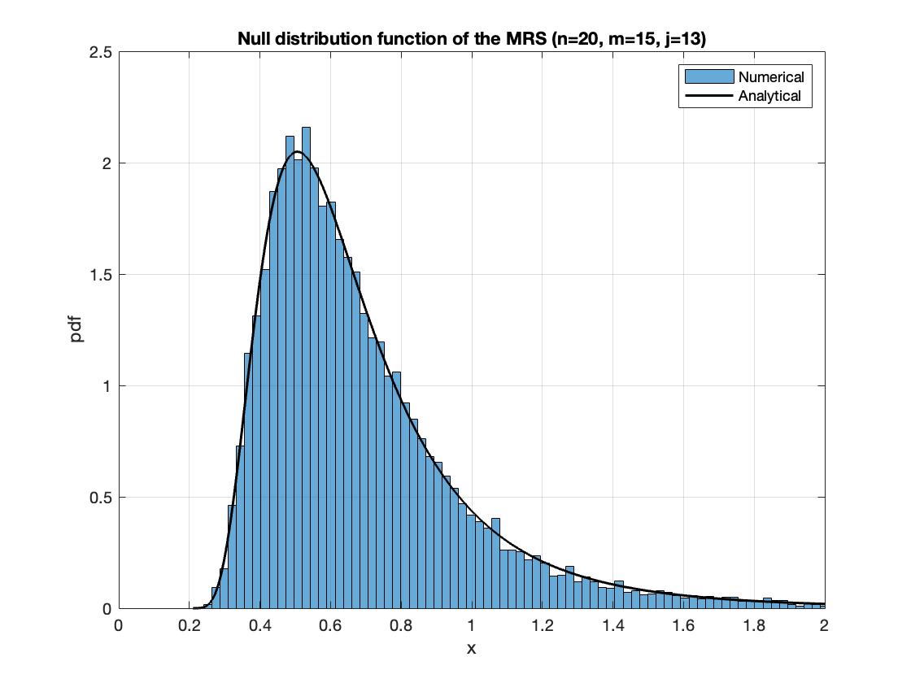
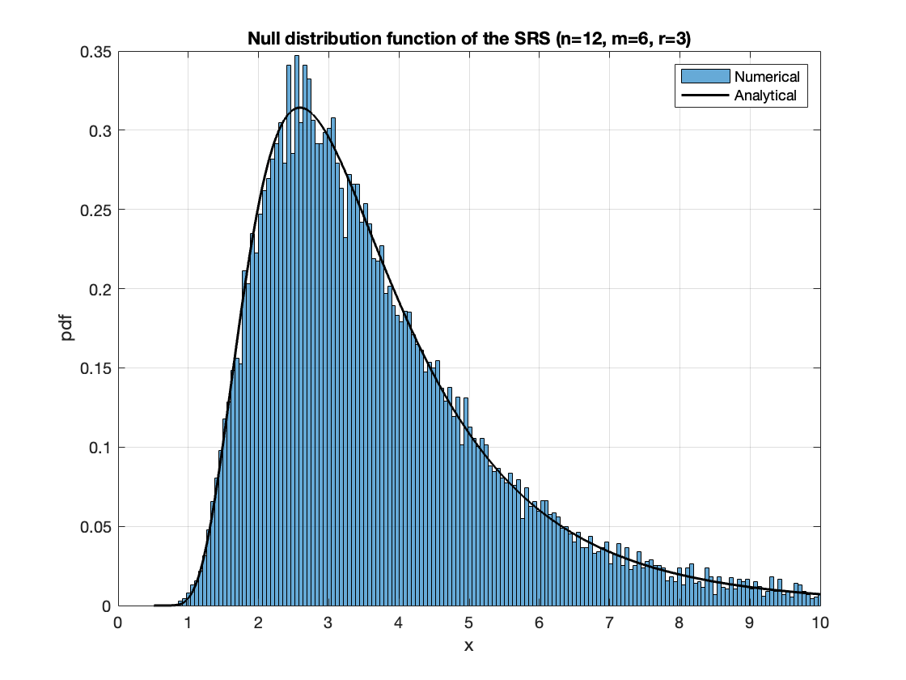

# Outlier Detection with MRS and SRS Statistics

This repository contains MATLAB implementations of the Max-Robust-Sum (MRS) and Sum-Robust-Sum (SRS) test statistics, along with illustrative figures for the alignment of derived probability distribution functions (pdfs) with numerical simulations. These statistics are designed to enhance the robustness of outlier detection in samples with exponential or Pareto tails.

## Contents
- `MRS_vpa.m`: MATLAB code for the MRS test statistic.
- `SRS_vpa.m`: MATLAB code for the SRS test statistic.
- `figure_MRS.png`: Sample figure showing the alignment of the derived PDF and numerical simulation for the MRS.
  
- `figure_SRS.png`: Sample figure showing the alignment of the derived PDF and numerical simulation for the SRS.
  

## Usage
To use the provided code, simply download the MATLAB files and run them within your MATLAB environment. Each script is self-contained and includes comments to guide you through the process of computing the null distribution functions for the given statistics.

## Figures
The figures included in this repository are the outcomes of the Matlab scripts and demonstrate the empirical verification of the theoretical derivations, showing a comparison between the analytical derivation and the numerical simulation for both MRS and SRS statistics.

## Reference
For detailed information on the derivation of these statistics and their application in outlier detection, please refer to the following paper:
- *Multiple Outlier Detection in Samples with Exponential & Pareto Tails* by Didier Sornette and Ran Wei.

This paper includes a comprehensive discussion on the use of these statistics, the theoretical foundation behind their derivations, and case studies demonstrating their effectiveness.
